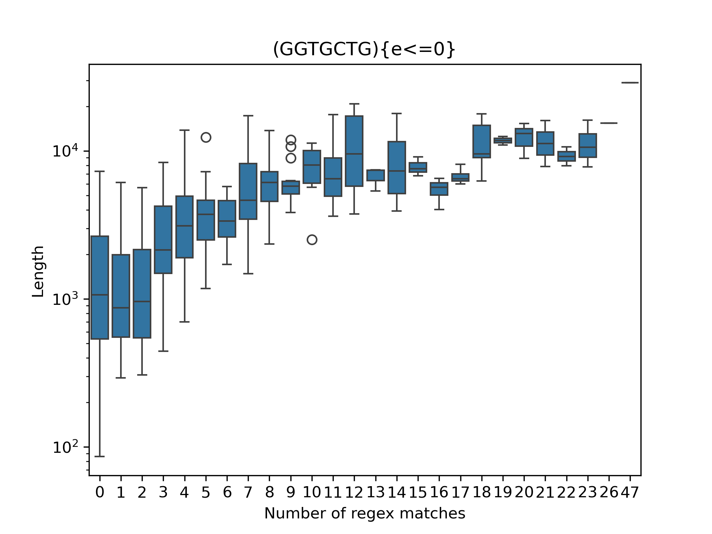
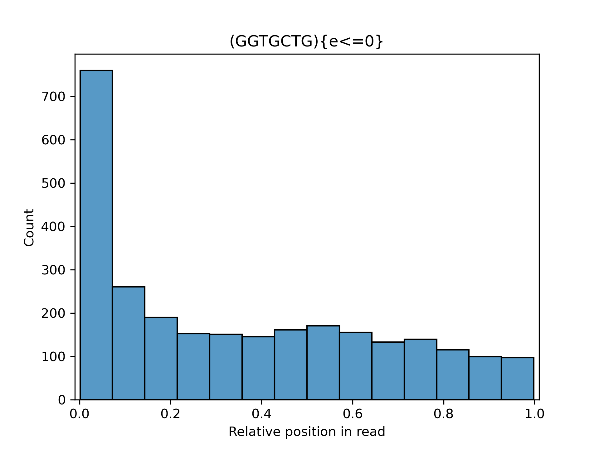

# splitReads <sub>*\*(HTbfRS)*</sub>
A script to split highly concatenated reads from oxford nanopore sequencing.

Works by identifying 5' barcode flanking regions from the [PCR barcoding kits](https://nanoporetech.com/document/chemistry-technical-document#barcode-sequences) and splits reads containing multiple (internal!) instances of this.
(This is a fairly naive aproach! results may vary!)

Future plans for this script:
```
- Search for the reverse complement of the flanking region.
Not all reads are sequenced in the same direction!

- Better file handling.
At the moment this script is super slow, especially for very large input files. 
```

## Script requirements
```
- python >= 3.11
- biopython
- pandas
- numpy
- matplotlib
- seaborn
```
## Script arguments
```
- file : (positional) a sequence file in the .fastq format
```
**It is highly recomended that large sequence files are split into multiple smaller files,
and then merged after running this script on each of them.**

## Examples
Example script usage:
```
split -l 1000000 data.fastq data.split.                           # Split the dataset into 250,000 read chunks
for file in data.split.*; do python splitReads.py $file; done     # Run the script on each one of these chunks
cat split_* > data_split.fastq                                    # Merge the chunks back into a single file
```


Example plot outputs:

The number of regex matches for the 5' barcoding region per read, compared to read length. Longer reads on average have many more matches for the 5' flanking region.



The relative position of regex matches for the 5' barcoding region read, in highly concatenated dataset. Most matches are at the 5' end of the read consistent with what is expected, but there are a continuous distribution of matches throughout the length of the read.



*\*Hacked Together (but/barely functional) read splitter*
